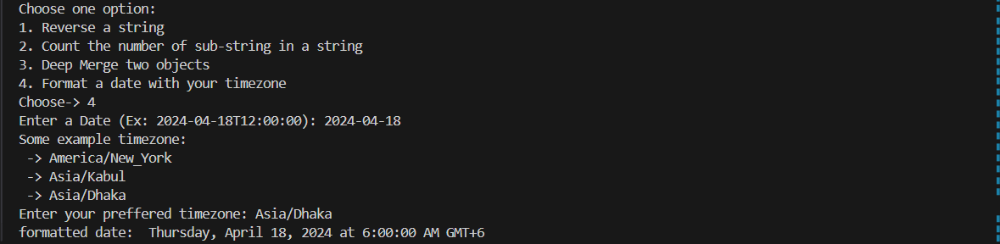

# SuperUtil
A JavaScript utility library with four functions supported currently 
 - **Reverse a given string**

   Return a reversed string from a given string.
 
   **Input:** `Fulflld`
 
   **Output:** `dllfluF`

  
- **Count number of a given substring is present within a given string**

  Return the total number of occurrences of a given substring within a given string.

  **Input 1:** `hello Fulflld hello`

  **Input 2:** `hello`

  **Output:** `2`

- **Deep merge 2 given objects**
  **Return a deep merged object of two objects**

  Return a deep merged object of two JavaScript objects.

  **Input 1:** `{ "a": 1}`

  **Input 2:** `{ "b": 2}`

  **Output:** `{ "a": 1, "b": 2}`

  
- **For a given date object and a provided timezone, output a string with date formatted and
converted to the given timezone**
  **Return a formatted date with a preferred timezone**

  Return a formatted date with a preferred timezone.

  **Input 1:** `2024-04-18T12:00:00`

  **Input 2:** `Asia/Dhaka`

  **Output:** `Thursday, April 18, 2024 at 6:00:00 AM GMT+6`

## Setup 
- **Open the Codesandbox url in the browser & sign up**
- **Open the terminal into the root folder & run 'npm run test'**
- **Voila! that's everything**

## Usage 
I have maed a command line interface based on the library. All you need to input the number of a functionality to check & follow the instructions.
 
 
  &emsp;

 ## Tools & Technologies 
- **Javascript**
- **Node js**
- **NPM**
  
